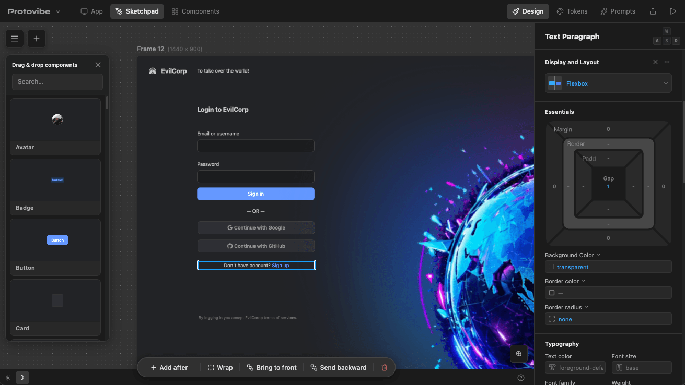

# Protovibe Studio

A visual editor web builder for React + Tailwind apps for rapidly creating and editing web projects with your own AI agent.



## Installation
Go to **[protovibe-studio.github.io](https://protovibe-studio.github.io)** and click "Download", then follow the instructions.

## Docs
Documentation and guide: **[protovibe-studio.github.io](https://protovibe-studio.github.io/docs)** 


<br/><br/>
<br/><br/>
<br/><br/>
<br/><br/>
---

## Contact Protovibe Team

Got feedback or noticed a bug? Contact us at protovibe.studio@gmail.com
 
## Monorepo Folder structure

### protovibe-project-manager

A React + Vite app that serves as the home screen. It lets you create, duplicate, delete, and run projects. The Vite dev server also exposes a REST/SSE API (`/api/projects/...`) that handles spawning and monitoring project dev servers.

```bash
cd protovibe-project-manager
pnpm install
pnpm dev
```

### protovibe-project-template && vite-plugin-protovibe (`protovibe-project-template/plugins/protovibe`)

The template that gets copied when you create a new project. It is a React + Vite app with Tailwind and the `vite-plugin-protovibe` plugin pre-wired. The plugin lives inside the template at `plugins/protovibe` and is consumed via a pnpm `link:` dependency (symlink) — the template's `postinstall` script handles installing the plugin's own deps and building its `dist/`, so a single `pnpm install` at the template root leaves everything ready to run.

```bash
cd protovibe-project-template
pnpm install        # also installs + builds the plugin via postinstall
pnpm dev            # just runs vite
```

When you are actively developing the plugin itself, run its watcher in a second terminal:

```bash
cd protovibe-project-template/plugins/protovibe
pnpm dev            # watches src, rebuilds dist/
```

Because the plugin is symlinked, rebuilds of `plugins/protovibe/dist/` are immediately visible to the template's Vite server — no reinstall needed.

### projects/

Created and managed by the project manager at runtime. Each subdirectory is an independent copy of `protovibe-project-template`. Do not edit these by hand — use the project manager UI instead to run the projects. *When developing with coding agents, open just the single project folder.*

## License & dual licensing

Protovibe operates under a dual-licensing model to ensure the project remains sustainable while protecting the core source code from unauthorized commercial exploitation by evil corporations.

### 1. The core application (AGPLv3)

The source code of the Protovibe application is licensed under the [GNU Affero General Public License v3](LICENSE) (AGPLv3).

**What this means:** You are free to use, modify, and distribute the application. However, if you modify the code or include it in a larger project and offer it over a network (e.g. a SaaS product), you must make your entire project's source code open and freely available under the AGPLv3.

### 2. Commercial license (proprietary use)

If you are a company that wants to embed Protovibe's source code into your own commercial, closed-source product, or if your company policies prohibit the use of AGPLv3 software, you must purchase a commercial license. This license grants you the right to use Protovibe's code in proprietary environments without the obligation to open-source your own software.

📧 Contact for commercial licensing: **protovibe.studio@gmail.com**

### 3. Output exception (your designs are yours)

The AGPLv3 license applies only to the Protovibe source code itself. Any output generated by using the Protovibe application (UI designs, exported HTML/CSS, JSON data, etc.) is your property. You can use the generated outputs in any commercial, proprietary, or personal project without any restrictions, attribution, or licensing fees.

### 4. Third-party dependencies

Protovibe bundles third-party packages (via `node_modules` and similar) that retain their original licenses (MIT, BSD, Apache-2.0, etc.). The AGPLv3 terms above apply to Protovibe's own source code; downstream redistributors remain responsible for complying with the licenses of those upstream dependencies.

## Contributing

See [CONTRIBUTING.md](CONTRIBUTING.md). By submitting a pull request, you agree to the Contributor License Agreement, which allows the project to be re-licensed commercially.
